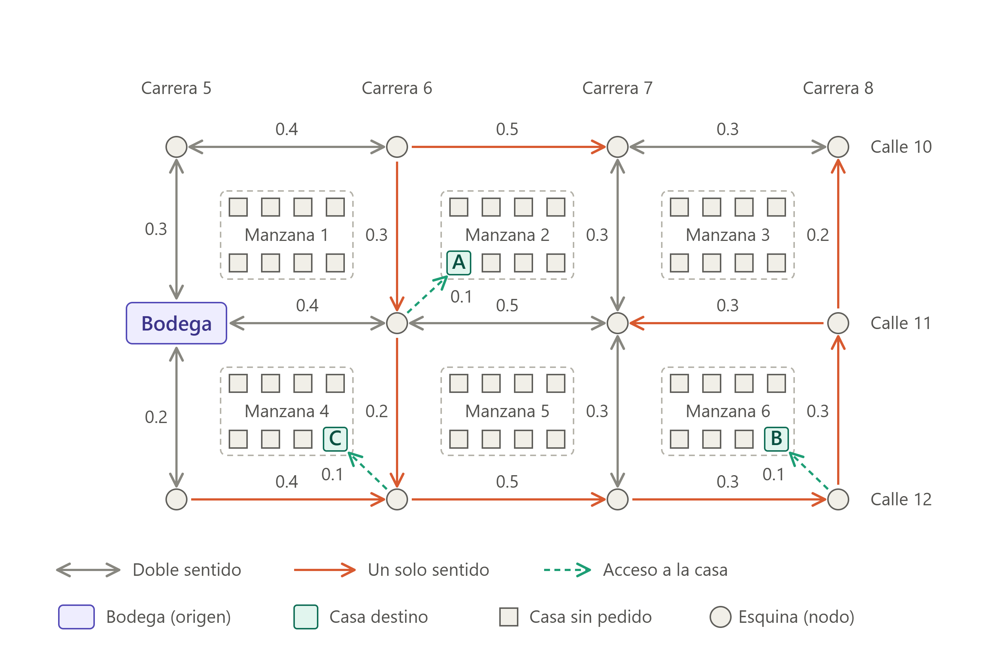

# Decisiones de diseño — Feature 1 (RutaPyme)

Este documento reúne las decisiones de modelado de la red operativa. Cada sección corresponde a una tarea del plan (`05-tareas-feature-1.md`).

---

## T06 · Dirección de la red

### Decisión

La red operativa de RutaPyme se modela como un **grafo dirigido**: los puntos son nodos y cada trayecto disponible es una arista con origen y destino. La arista A→B no implica la existencia de B→A.

### Justificación

No todas las calles son bidireccionales. Un trayecto que puede recorrerse de A hacia B puede estar cerrado, ser de un solo sentido o no existir en sentido contrario. Si modeláramos la red como no dirigida, cada conexión se podría recorrer en ambos sentidos, y el sistema podría recomendar al despachador una ruta por una calle que en la realidad solo permite circular en un sentido.

Esto afecta directamente al negocio. El brief describe que RutaPyme "a veces envía un pedido por una conexión cerrada". Un modelo dirigido evita ese error porque el sistema solo reconoce los trayectos que realmente se registraron, en el sentido en que se registraron.

También cambia las consultas futuras: al ser el grafo dirigido, el camino de ida entre dos puntos puede ser distinto del camino de vuelta. Las consultas de cobertura (F2) y de ruta de menor costo (F3) deben respetar el sentido de cada arista, y por eso se calculan con caminos dirigidos.

### Respuesta a la pregunta del brief

> ¿Una conexión A→B siempre permite B→A?

**No.** Una conexión A→B solo permite ir de A a B. Para poder ir de B a A debe registrarse una conexión B→A de forma explícita.

Ejemplo con la red de prueba: la calle que lleva de la bodega al barrio Norte es de un solo sentido. Existe Bodega→Norte, pero no Norte→Bodega, así que un pedido no puede regresar por esa calle.

### Reglas que se derivan de la decisión

1. **A→B y B→A son aristas distintas e independientes.** Pueden existir una, ambas o ninguna. Existir una no obliga a que exista la otra.
2. **Una conexión duplicada** es aquella que repite el mismo par ordenado (origen, destino). Registrar A→B dos veces se rechaza. Registrar A→B y después B→A **no** es un duplicado.
3. **Si existen A→B y B→A entre puntos vecinos, ambas tienen el mismo costo.** El peso representa una distancia en kilómetros, y la distancia entre dos puntos vecinos es la misma sin importar el sentido en que se recorra. Lo que cambia con el sentido es si el trayecto existe, no cuánto mide.
4. Al consultar los vecinos de un punto, se devuelven solo los **vecinos salientes** (los destinos de las aristas que salen de él).

### Consecuencias para el diseño

- La estructura de datos (T08) debe guardar cada arista una sola vez, bajo su nodo de origen. No se debe insertar la arista inversa automáticamente.
- Las validaciones de T09 deben comprobar duplicados por par ordenado.
- El contrato de la API (T10) debe pedir siempre origen y destino por separado, de modo que el orden se respete.

### Auto-lazos (A→A): no aplican

No se permiten conexiones de un punto hacia sí mismo. El motivo es el peso: el costo de cada conexión es una distancia en kilómetros que debe ser **siempre positiva**. La distancia de un punto a sí mismo es 0 km, lo que incumple esa regla. Además, un trayecto de un punto hacia sí mismo no representa ninguna entrega real, y en los recorridos de F2 y F3 nunca aportaría un camino nuevo ni uno más barato.

Regla de validación: si el origen y el destino son el mismo punto, la conexión se rechaza con un mensaje claro (por ejemplo, "el origen y el destino deben ser distintos"). Este caso se incluye en el script de aceptación.

### Aristas paralelas: no aplican

No se permiten varias aristas entre el mismo par ordenado (origen, destino). Cada par tiene como máximo una arista, y un segundo intento con el mismo par se rechaza como duplicado, aunque traiga un costo distinto. Con esto el grafo es un **grafo dirigido simple**.

### Costos distintos en sentidos opuestos: se rechazan

El sistema hace cumplir la regla 3. Si ya existe A→B con un costo y se intenta registrar B→A con un costo diferente, la conexión se rechaza por inconsistente. Por ejemplo, con A→B de 4 km registrado, B→A con 6 km se rechaza, y B→A con 4 km se acepta.

El mensaje de error debe indicar el costo ya registrado en el sentido opuesto, para que el coordinador pueda corregir el dato. Este caso se incluye en el script de aceptación (T31).

Alternativas descartadas: aceptar ambos costos tal cual (la regla 3 quedaría solo como convención y los datos podrían contradecirla) y copiar el costo automáticamente (el sistema decidiría por el usuario y complicaría el contrato de la API).

### Alcance de la regla 3: solo puntos vecinos

La regla 3 (mismo costo en ambos sentidos) aplica únicamente a **conexiones directas** entre dos puntos, es decir, cuando existen A→B y B→A como aristas registradas. Cuando dos puntos no son vecinos, no hay arista que comparar, y el costo total de ir de uno a otro por rutas distintas puede diferir según el sentido. Esto no es una inconsistencia y el sistema no lo valida.

---

## T07 · Significado y unidad del peso

### Decisión

El peso de cada arista es la **distancia en kilómetros (km)** del trayecto entre el punto de origen y el punto de destino. Es un número decimal **estrictamente mayor que 0**.

### Justificación

- **Una sola magnitud y unidad en toda la red.** Todos los pesos son distancias en km, así que se pueden sumar y comparar entre sí. En F3, "menor costo" significará "menor distancia total recorrida".
- **Siempre positivo.** Un trayecto real entre dos puntos distintos mide más de 0 km, y una distancia negativa no existe. Además, el algoritmo de ruta de menor costo de F3 exige pesos positivos para dar resultados correctos.
- **Decimal.** Las distancias entre barrios no son enteras (por ejemplo, 2.5 km), así que el peso admite parte decimal.
- **Coherencia con la dirección.** Como el peso es una distancia, entre puntos vecinos es el mismo en ambos sentidos (regla 3 de T06).

### Reglas de validación del peso

1. El costo debe ser un número. Un texto, un valor vacío o un valor ausente se rechazan.
2. El costo debe ser mayor que 0. El cero y los negativos se rechazan.
3. Los valores no finitos (infinito, NaN) se rechazan.
4. El costo admite como máximo **7 decimales** (precisión de 0.0000001 km). Un valor con más de 7 decimales se rechaza.

### Limitación aceptada

La distancia no es el tiempo de viaje: una ruta más corta en km puede tardar más por tráfico o por el tipo de vía. RutaPyme no modela tráfico en tiempo real (fuera de alcance según el brief), por lo que "menor costo" equivale a "menor distancia".

### Tipo numérico: `Decimal`

El costo se representa con el tipo `Decimal` de Python. Con hasta 7 decimales, `float` no representa exactamente muchos valores (por ejemplo, 0.1234567) y comparar costos para la regla 3 de T06, o sumarlos en F3, podría fallar por redondeo. `Decimal` hace exactas la suma y la comparación.

Consecuencia: `Decimal` no se serializa a JSON directamente, así que la API recibe el costo y lo devuelve como texto o número y lo convierte en el límite del sistema. El formato exacto se fija en T10.

---

## T08 · Representación principal del grafo

### Decisión

La red se guarda como una **lista de adyacencia implementada con diccionarios anidados**: para cada punto de origen, un diccionario que asocia cada destino con el costo de la conexión.

```
{ origen: { destino: costo_km } }
```

Los puntos (identificador y tipo) se guardan en una estructura aparte, de modo que un punto sin conexiones también existe en la red.

### Comparación de alternativas

V es el número de puntos y E el de conexiones. En una red de entregas cada punto tiene pocos trayectos directos, así que la red es **dispersa** (E mucho menor que V²), incluso si el modelo se hiciera por calles en lugar de por barrios.

| | Memoria | ¿Existe A→B? | Vecinos salientes de A | Agregar punto | Agregar conexión |
|---|---|---|---|---|---|
| **Lista de adyacencia (dict de dicts)** | O(V + E) | O(1) promedio | O(grado de A) | O(1) | O(1) |
| Matriz de adyacencia | O(V²) | O(1) | O(V) | O(V²) al redimensionar | O(1) |
| Lista de aristas | O(E) | O(E) | O(E) | O(1) | O(1) si no valida duplicados; O(E) si valida |

### Justificación

El brief plantea dos operaciones para decidir la estructura:

1. **Consultar todos los vecinos de un punto.** Es la operación que repiten los recorridos de F2 (alcance) y el algoritmo de ruta de menor costo de F3. En la lista de adyacencia cuesta O(grado del punto), mientras que en la matriz exige revisar una fila completa, O(V), y en la lista de aristas recorrer todas las conexiones, O(E).
2. **Revisar una pareja de puntos.** La usan las validaciones de F1: conexión duplicada, punto inexistente y costo inconsistente con la conexión inversa (T06). Con diccionarios anidados cada una es una búsqueda directa de costo O(1) en promedio.

La matriz solo sería preferible en un grafo denso, y gastaría memoria O(V²) en una red donde casi todas las celdas estarían vacías. La lista de aristas es la más simple, pero haría que cada validación recorra el grafo completo.

Esta estructura también respeta la decisión de dirección (T06): cada conexión A→B se guarda una sola vez, bajo su origen. La conexión inversa B→A, si existe, es una entrada independiente.

### Variante descartada

Diccionario de listas de tuplas (`{origen: [(destino, costo)]}`). Es equivalente para listar vecinos, pero comprobar duplicados y la conexión inversa costaría O(grado) en lugar de O(1).

### Limitaciones aceptadas

- **Listar todas las conexiones** exige recorrer los dos niveles del diccionario, O(V + E). Es suficiente para F1.
- **Consultar las conexiones entrantes** de un punto (quién llega a B) no es eficiente, porque las conexiones se guardan por origen. F1 no lo requiere.
- Para mostrar la red en un orden estable se ordenan los puntos al listarlos.

### Ejemplo con la red de prueba

| Origen | Destinos (destino: km) |
|---|---|
| Bodega | Norte: 4, Sur: 7 |
| Norte | Punto: 5 |
| Sur | Punto: 2 |
| Punto | Sur: 2 |

Los costos de Sur→Punto y Punto→Sur coinciden (2 km), como exige la regla 3 de T06. Este ejemplo sustituye al dibujo de T11 si el equipo adopta otros datos.

---

## T09 · Reglas de validación

### Principio

Las validaciones protegen tres invariantes de la red:

1. **Integridad referencial:** toda conexión une dos puntos que existen.
2. **Unicidad:** no hay dos puntos con el mismo UUID (lo garantiza el sistema al generarlo) ni dos conexiones con el mismo par ordenado (origen, destino).
3. **Peso válido y coherente:** todo costo es un número positivo con hasta 7 decimales, y las conexiones inversas entre vecinos tienen el mismo costo.

Las reglas se aplican en el **núcleo del grafo**, no solo en la API, para que ninguna otra vía de entrada pueda corromper la red. La API traduce cada rechazo a una respuesta de error (los códigos HTTP se fijan en T10).

### Reglas para crear un punto

| Id | Condición | Resultado |
|---|---|---|
| P1 | Falta el nombre o el tipo | Rechazar: dato obligatorio ausente |
| P2 | El nombre es un texto vacío o solo espacios | Rechazar: nombre inválido |
| P3 | El tipo no es uno de los permitidos (`warehouse`, `neighborhood`, `pickup_point`) | Rechazar: tipo inválido |
| P4 | Todo lo anterior se cumple | Aceptar, generar un UUID nuevo y registrar el punto sin conexiones. La respuesta devuelve el UUID. |

### Reglas para crear una conexión

Se evalúan **en este orden** y se informa el primer error encontrado:

| Orden | Id | Condición | Resultado |
|---|---|---|---|
| 1 | C1 | Falta el origen, el destino o el costo | Rechazar: dato obligatorio ausente |
| 2 | C2 | El UUID de origen no tiene formato válido, o no corresponde a ningún punto | Rechazar: origen inexistente |
| 3 | C3 | El UUID de destino no tiene formato válido, o no corresponde a ningún punto | Rechazar: destino inexistente |
| 4 | C4 | El origen y el destino son el mismo punto | Rechazar: auto-lazo no permitido |
| 5 | C5 | El costo no es un número, o no es finito (infinito, NaN) | Rechazar: costo inválido |
| 6 | C6 | El costo es menor o igual que 0 | Rechazar: costo no positivo |
| 7 | C7 | El costo tiene más de 7 decimales | Rechazar: precisión excedida |
| 8 | C8 | Ya existe una conexión con el mismo origen y destino | Rechazar: conexión duplicada, aunque el costo sea distinto |
| 9 | C9 | Existe la conexión inversa con un costo distinto | Rechazar: costo inconsistente con la conexión inversa |
| 10 | C10 | Todo lo anterior se cumple | Aceptar y registrar la conexión |

### Casos que se aceptan (no son errores)

- Registrar **B→A después de A→B** con el **mismo costo** (conexión inversa consistente).
- Registrar un punto sin ninguna conexión.
- Registrar dos puntos con el **mismo nombre**: reciben UUID distintos y ambos son válidos.
- Consultar la red cuando está vacía (devuelve vacío, no un error).

### Por qué este orden

- **Existencia antes que costo** (C2 y C3 antes de C5): un error de referencia es más informativo para el coordinador que uno de formato del costo, y evita revisar el costo de una conexión que no puede existir.
- **Duplicado antes que inversa** (C8 antes de C9): si A→B ya existe, el intento se rechaza como duplicado sin consultar más.
- **La inversa se consulta al final** (C9), porque solo tiene sentido comprobar la coherencia de una conexión que de otro modo sería válida.

### Mensajes de error

Cada rechazo devuelve un mensaje claro y específico, sin revelar detalles internos. Ejemplos:

- C2: "El punto de origen 'X' no existe."
- C4: "El origen y el destino deben ser distintos."
- C6: "El costo debe ser mayor que 0 km."
- C8: "Ya existe una conexión de 'A' a 'B'."
- C9: "Ya existe la conexión de 'B' a 'A' con un costo de 4 km; el costo en ambos sentidos debe coincidir."

### Decisiones pendientes

- **Tipos de punto (P3): lista cerrada.** Los tipos válidos son `warehouse`, `neighborhood` y `pickup_point`, tomados del brief. Cualquier otro valor se rechaza. Con esto no hay variantes de escritura del mismo tipo y F2 y F3 pueden apoyarse en el tipo (por ejemplo, partir de una bodega). Agregar un tipo nuevo exige cambiar el código.
- **Identificador: UUID generado por el sistema.** Cada punto recibe un UUID al crearse, y la respuesta lo devuelve. Toda búsqueda y toda referencia (origen y destino de una conexión, vecinos de un punto) usa el UUID. Las claves de la lista de adyacencia (T08) son UUID. El cliente no envía el UUID, por lo que el sistema no puede recibir uno repetido.
- **Nombre del punto.** Es obligatorio, no puede ser vacío ni solo espacios, y es solo informativo: no se usa para buscar. Por ahora se **permiten nombres repetidos**; dos puntos con el mismo nombre se distinguen por su UUID y por su tipo. Si el equipo decide más adelante rechazarlos, se agrega una regla P y su escenario de aceptación.
- **Códigos HTTP** de cada error: se fijan en T10.

---

## T11 · Red de ejemplo (mapa de calles y carreras)

### Dibujo



El mapa representa un sector con 3 calles (10, 11 y 12) y 4 carreras (5, 6, 7 y 8). Cada **esquina** es un nodo, la **bodega** ocupa la esquina de la Calle 11 con la Carrera 5, y las casas **A**, **B** y **C** son destinos de entrega. Cada tramo de calle es una arista con su distancia en km. Las calles de doble sentido son dos aristas con el mismo costo (regla 3 de T06) y las de un solo sentido son una sola arista. Los cuadros grises sin letra son casas sin pedido: adornan el mapa y no son nodos.

### Sentido de las calles

| Vía | Sentido |
|---|---|
| Calle 10 | Doble sentido, salvo el tramo Carrera 6 a Carrera 7, que es de un solo sentido hacia el este |
| Calle 11 | Doble sentido, salvo el tramo Carrera 8 a Carrera 7, que es de un solo sentido hacia el oeste |
| Calle 12 | Un solo sentido, hacia el este |
| Carrera 5 | Doble sentido |
| Carrera 6 | Un solo sentido, hacia el sur |
| Carrera 7 | Doble sentido |
| Carrera 8 | Un solo sentido, hacia el norte |

### Nodos

Las etiquetas son de documentación. En el sistema, cada punto recibe un UUID generado al crearlo.

| Etiqueta | Qué es |
|---|---|
| `BOD` | Bodega (esquina Calle 11 con Carrera 5) |
| `C10K5`, `C10K6`, `C10K7`, `C10K8` | Esquinas de la Calle 10 con las carreras 5 a 8 |
| `C11K6`, `C11K7`, `C11K8` | Esquinas de la Calle 11 con las carreras 6 a 8 |
| `C12K5`, `C12K6`, `C12K7`, `C12K8` | Esquinas de la Calle 12 con las carreras 5 a 8 |
| `CasaA`, `CasaB`, `CasaC` | Casas destino |

En total hay 15 nodos y 28 aristas dirigidas.

### Aristas dirigidas (origen → destino, km)

| # | Origen | Destino | km | Tramo |
|---|---|---|---|---|
| 1 | `C10K5` | `C10K6` | 0.4 | Calle 10 |
| 2 | `C10K6` | `C10K5` | 0.4 | Calle 10 |
| 3 | `C10K6` | `C10K7` | 0.5 | Calle 10 (un sentido) |
| 4 | `C10K7` | `C10K8` | 0.3 | Calle 10 |
| 5 | `C10K8` | `C10K7` | 0.3 | Calle 10 |
| 6 | `BOD` | `C11K6` | 0.4 | Calle 11 |
| 7 | `C11K6` | `BOD` | 0.4 | Calle 11 |
| 8 | `C11K6` | `C11K7` | 0.5 | Calle 11 |
| 9 | `C11K7` | `C11K6` | 0.5 | Calle 11 |
| 10 | `C11K8` | `C11K7` | 0.3 | Calle 11 (un sentido) |
| 11 | `C12K5` | `C12K6` | 0.4 | Calle 12 (un sentido) |
| 12 | `C12K6` | `C12K7` | 0.5 | Calle 12 (un sentido) |
| 13 | `C12K7` | `C12K8` | 0.3 | Calle 12 (un sentido) |
| 14 | `C10K5` | `BOD` | 0.3 | Carrera 5 |
| 15 | `BOD` | `C10K5` | 0.3 | Carrera 5 |
| 16 | `BOD` | `C12K5` | 0.2 | Carrera 5 |
| 17 | `C12K5` | `BOD` | 0.2 | Carrera 5 |
| 18 | `C10K6` | `C11K6` | 0.3 | Carrera 6 (un sentido) |
| 19 | `C11K6` | `C12K6` | 0.2 | Carrera 6 (un sentido) |
| 20 | `C10K7` | `C11K7` | 0.3 | Carrera 7 |
| 21 | `C11K7` | `C10K7` | 0.3 | Carrera 7 |
| 22 | `C11K7` | `C12K7` | 0.3 | Carrera 7 |
| 23 | `C12K7` | `C11K7` | 0.3 | Carrera 7 |
| 24 | `C11K8` | `C10K8` | 0.2 | Carrera 8 (un sentido) |
| 25 | `C12K8` | `C11K8` | 0.3 | Carrera 8 (un sentido) |
| 26 | `C11K6` | `CasaA` | 0.1 | Acceso a la casa |
| 27 | `C12K6` | `CasaC` | 0.1 | Acceso a la casa |
| 28 | `C12K8` | `CasaB` | 0.1 | Acceso a la casa |

### Cómo se cumple lo que pide la red de ejemplo

| Característica | Dónde se ve en el mapa |
|---|---|
| Aristas de un solo sentido | Calle 12, Carreras 6 y 8, y un tramo en cada una de las Calles 10 y 11 |
| Pares de ida y vuelta con el mismo costo | Carreras 5 y 7, y los tramos de doble sentido de las calles |
| Varios caminos entre los mismos puntos | Por ejemplo, de `BOD` a `C12K8` hay rutas por la Calle 12 y por la Calle 11 |
| Costos decimales en km | Todos los pesos |

### Pendiente por revisar

- **Destino no alcanzable (F2).** En este mapa todas las casas destino se alcanzan desde la bodega. Para probar "destino desconectado" hará falta agregar un punto aislado o quitar una arista en la demostración.
- **"Menos saltos no es menor costo" (F3).** Los costos actuales no muestran todavía un caso claro de dos rutas con distinto número de saltos y distinto costo. Se debe ajustar algún peso antes de F3.
- **Tipo de cada nodo.** La lista cerrada de T09 es `warehouse`, `neighborhood` y `pickup_point`. La bodega es `warehouse` y las casas destino encajan como `pickup_point`, pero las esquinas no tienen un tipo claro. Hay que decidir cómo clasificarlas.

---

## T12 · Traza manual de las operaciones

### Alcance de la traza

La traza usa un **subconjunto de 5 nodos** del mapa de T11 (opción A). Incluye un par de ida y vuelta con el mismo costo, una arista de un solo sentido, una casa destino con su acceso y un punto sin conexiones salientes.

| Etiqueta | Qué es | Tipo usado en la traza |
|---|---|---|
| `BOD` | Bodega | `warehouse` |
| `C11K6` | Esquina Calle 11 con Carrera 6 | `neighborhood` (provisional) |
| `C10K5` | Esquina Calle 10 con Carrera 5 | `neighborhood` (provisional) |
| `C10K6` | Esquina Calle 10 con Carrera 6 | `neighborhood` (provisional) |
| `CasaA` | Casa destino A | `pickup_point` |

El tipo de las esquinas sigue pendiente de decisión (ver "Pendiente por revisar" en T11). En la traza se usa `neighborhood` solo para poder ejecutar los pasos. Las etiquetas representan el UUID que el sistema genera en cada alta.

### Notación

El estado es la lista de adyacencia `{origen: {destino: km}}` de T08. Un punto recién creado aparece con un diccionario vacío. Las llamadas siguen la interfaz de `Graph` de `api.md`; los costos se envían como texto.

### Parte 1: crear puntos

| Paso | Operación | Estado después | Resultado |
|---|---|---|---|
| 1 | `add_point("Bodega", warehouse)` | `{BOD: {}}` | Aceptado (P4). Devuelve el UUID de `BOD` |
| 2 | `add_point("Esquina C11-K6", neighborhood)` | `{BOD: {}, C11K6: {}}` | Aceptado |
| 3 | `add_point("Esquina C10-K5", neighborhood)` | `{BOD: {}, C11K6: {}, C10K5: {}}` | Aceptado |
| 4 | `add_point("Esquina C10-K6", neighborhood)` | `{BOD: {}, C11K6: {}, C10K5: {}, C10K6: {}}` | Aceptado |
| 5 | `add_point("Casa A", pickup_point)` | `{BOD: {}, C11K6: {}, C10K5: {}, C10K6: {}, CasaA: {}}` | Aceptado |

### Parte 2: crear conexiones válidas

Cada fila agrega una entrada solo bajo el **origen**. La conexión inversa no se crea sola.

| Paso | Operación | Cambio en el estado | Resultado |
|---|---|---|---|
| 6 | `BOD → C11K6`, `"0.4"` | `BOD: {C11K6: 0.4}` | Aceptado (C10) |
| 7 | `C11K6 → BOD`, `"0.4"` | `C11K6: {BOD: 0.4}` | Aceptado: sentido contrario con el mismo costo |
| 8 | `BOD → C10K5`, `"0.3"` | `BOD: {C11K6: 0.4, C10K5: 0.3}` | Aceptado |
| 9 | `C10K5 → BOD`, `"0.3"` | `C10K5: {BOD: 0.3}` | Aceptado |
| 10 | `C10K5 → C10K6`, `"0.4"` | `C10K5: {BOD: 0.3, C10K6: 0.4}` | Aceptado |
| 11 | `C10K6 → C10K5`, `"0.4"` | `C10K6: {C10K5: 0.4}` | Aceptado |
| 12 | `C10K6 → C11K6`, `"0.3"` | `C10K6: {C10K5: 0.4, C11K6: 0.3}` | Aceptado. Es de un solo sentido: no existe `C11K6 → C10K6` |
| 13 | `C11K6 → CasaA`, `"0.1"` | `C11K6: {BOD: 0.4, CasaA: 0.1}` | Aceptado (acceso a la casa) |

**Estado final después del paso 13:**

```
BOD:   { C11K6: 0.4, C10K5: 0.3 }
C11K6: { BOD: 0.4,   CasaA: 0.1 }
C10K5: { BOD: 0.3,   C10K6: 0.4 }
C10K6: { C10K5: 0.4, C11K6: 0.3 }
CasaA: { }
```

Este estado corresponde a las aristas 1, 2, 6, 7, 14, 15, 18 y 26 de la tabla de T11.

### Parte 3: rechazos

En todas las filas el estado queda **idéntico al estado final de la Parte 2**: una operación rechazada no modifica nada. Las reglas se evalúan en el orden de T09.

| Paso | Operación | Regla que rechaza | Resultado (HTTP y `code`) | Cómo se detecta en la estructura |
|---|---|---|---|---|
| 14 | `BOD → C11K6`, `"0.4"` | C8 | 409 `DUPLICATE_CONNECTION` | `C11K6` ya es clave de `adj[BOD]` |
| 15 | `BOD → C11K6`, `"0.9"` | C8 | 409 `DUPLICATE_CONNECTION` | Mismo sentido: es duplicado aunque cambie el costo |
| 16 | `C11K6 → C10K6`, `"0.5"` | C9 | 409 `INCONSISTENT_COST` | `adj[C10K6][C11K6]` vale 0.3 y el costo nuevo es 0.5. El mensaje indica el 0.3 registrado |
| 17 | `P99 → BOD`, `"0.2"` | C2 | 404 `ORIGIN_NOT_FOUND` | `P99` no es clave de la estructura |
| 18 | `BOD → P99`, `"0.2"` | C3 | 404 `DESTINATION_NOT_FOUND` | `P99` no está registrado |
| 19 | `BOD → BOD`, `"0.2"` | C4 | 422 `SELF_LOOP` | Origen y destino son iguales |
| 20 | `BOD → CasaA`, `"abc"` | C5 | 400 `INVALID_COST` | El costo no es un decimal |
| 21 | `BOD → CasaA`, `"-0.5"` | C6 | 422 `NON_POSITIVE_COST` | El costo es menor o igual que 0 |
| 22 | `BOD → CasaA`, `"0.12345678"` | C7 | 422 `COST_PRECISION` | Tiene 8 decimales y el máximo es 7 |
| 23 | `P99 → BOD`, `"-1"` | C2 (y C6) | 404 `ORIGIN_NOT_FOUND` | Dos reglas se rompen, pero solo se informa la primera en el orden de T09 |

Notas de la traza:

- En el paso 14 el sentido es el mismo que el del paso 6, por eso es duplicado. En el paso 7, en cambio, el sentido es contrario y se acepta porque el costo coincide.
- El paso 16 es el caso contrario del paso 7: la conexión inversa ya existe (`C10K6 → C11K6`, 0.3), así que `C11K6 → C10K6` solo es válida con el mismo costo, 0.3.
- Verificar el paso 16 cuesta una búsqueda directa en dos niveles de diccionario, O(1) en promedio. Esta es la razón principal de elegir diccionarios anidados en T08.

### Parte 4: consultas

| Paso | Consulta | Cómo se obtiene | Resultado |
|---|---|---|---|
| 24 | `neighbors(C11K6)` | Se lee `adj[C11K6]`, con 2 entradas, O(grado) | `{BOD: 0.4, CasaA: 0.1}` |
| 25 | `neighbors(CasaA)` | Se lee `adj[CasaA]` | `{}`: un punto sin salidas es válido, no es un error |
| 26 | `neighbors(P99)` | `P99` no es clave | Error `PointNotFound` (el núcleo lo lanza; F1 no lo expone por la API) |

La consulta de la red legible (`GET /network`) devolvería, para este estado, cada punto con sus conexiones salientes. El resultado debe coincidir con el estado final de la Parte 2.

### Comprobación

- La traza cubre los tres rechazos que pide la tarea (duplicado: pasos 14 y 15; punto inexistente: 17 y 18; costo inválido: 20 a 22) y otros cinco más.
- En todos los rechazos el estado no cambia.
- El estado final coincide con las 8 aristas del mapa de T11 incluidas en el subconjunto.
- Los pasos de la Parte 3 pueden convertirse directamente en escenarios del script de aceptación (T31).
